# My Tasks (V3) — AWS EC2 Deployment Guide

> **Deployment type:** Dockerized full-stack application on AWS EC2  
> **Database:** Supabase PostgreSQL  
> **Container registry:** Docker Hub  
> **OS:** Ubuntu Server  
> **Version:** V3

This document records the **actual AWS EC2 deployment workflow** used for the My Tasks V3 application. It is written as a reusable DevOps deployment guide so another person can follow the same process on a fresh EC2 instance.

---

## 1. Application and Deployment Architecture

The AWS deployment uses one EC2 instance to run the two application containers:

- **Frontend container:** React/Vite production build served by Nginx on port `80`
- **Backend container:** Flask application served by Gunicorn on port `5000`
- **Database:** Supabase PostgreSQL outside the EC2 instance
- **Container images:** pulled from Docker Hub
- **Authentication:** JWT with User/Admin roles

### AWS EC2 architecture

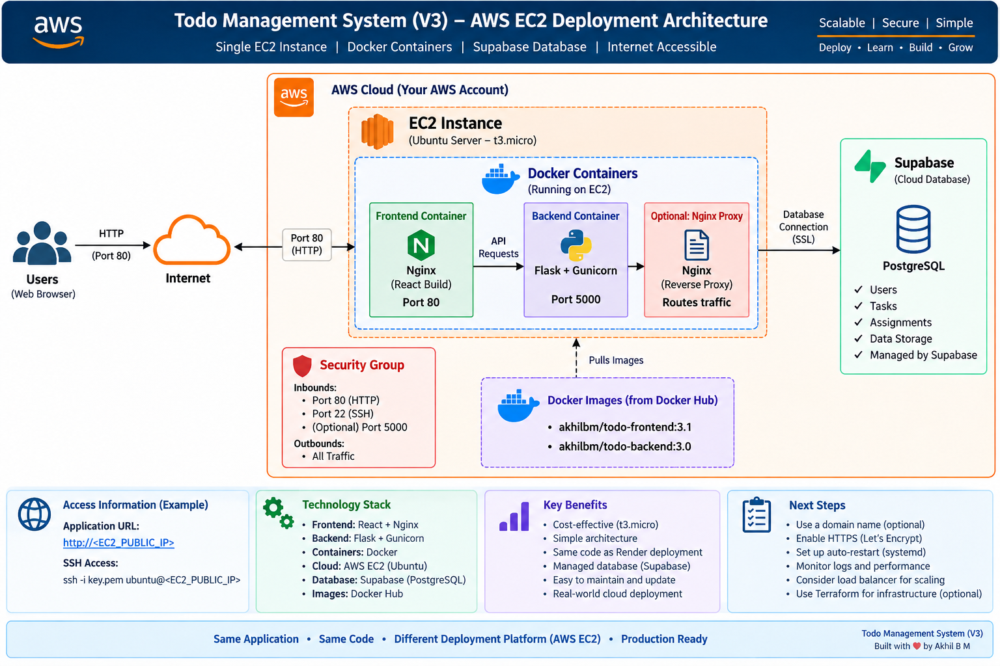


```mermaid
flowchart LR
    U[User / Browser]
    SG[AWS Security Group\n22 SSH | 80 HTTP | 5000 API]
    EC2[AWS EC2 - Ubuntu\nt3.micro]
    F[Frontend Container\nReact + Nginx\nPort 80]
    B[Backend Container\nFlask + Gunicorn\nPort 5000]
    DH[Docker Hub\nakhilbm/todo-frontend:3.1\nakhilbm/todo-backend:3.0]
    DB[(Supabase PostgreSQL)]

    U -->|HTTP :80| SG
    SG --> EC2
    EC2 --> F
    EC2 --> B
    F -->|API requests| B
    B -->|PostgreSQL / SSL| DB
    DH -->|docker pull| EC2
```

### Deployment flow

```text
GitHub source code
       |
       v
Build Docker images
       |
       v
Docker Hub
       |
       | docker pull
       v
+----------------------------------+
| AWS EC2 - Ubuntu                 |
|                                  |
|  +----------------------------+  |
|  | Frontend Container         |  |
|  | React build + Nginx :80    |  | <---- Browser
|  +-------------+--------------+  |
|                | API              |
|                v                  |
|  +----------------------------+  |
|  | Backend Container          |  |
|  | Flask + Gunicorn :5000     |  |
|  +-------------+--------------+  |
+----------------|-----------------+
                 |
                 | PostgreSQL / SSL
                 v
        Supabase PostgreSQL
```

> **Important V3 note:** the frontend image contains the API base URL used when the frontend was built. For a completely standalone EC2 deployment, the frontend should be built with the EC2 backend URL (for example `http://<EC2_PUBLIC_IP>:5000`) before creating the frontend image. The screenshots in this report document the EC2 container deployment, health checks, and browser validation that were performed during the deployment.

---

## 2. AWS Resources Used

| Resource | Configuration used |
|---|---|
| Cloud platform | AWS |
| Compute | EC2 |
| Instance type | `t3.micro` |
| OS | Ubuntu Server |
| Region | `eu-north-1` (Europe/Stockholm) |
| Availability Zone | `eu-north-1a` |
| Root storage | `8 GiB gp3` |
| Public IPv4 | Enabled |
| Database | Supabase PostgreSQL |
| Registry | Docker Hub |
| Containers | Frontend + Backend |

### IAM requirement

**No AWS IAM role is required for this application deployment.**

The application does not access AWS services from inside the containers. The backend connects directly to Supabase PostgreSQL using the database connection string supplied through environment variables.

---

# 3. Launch the EC2 Instance

Open the AWS Console and navigate to **EC2 → Instances → Launch instances**.

### 3.1 Name the instance

Use a descriptive name such as:

```text
task-management
```

### 3.2 Select the operating system

Choose **Ubuntu Server** from the Quick Start AMIs.

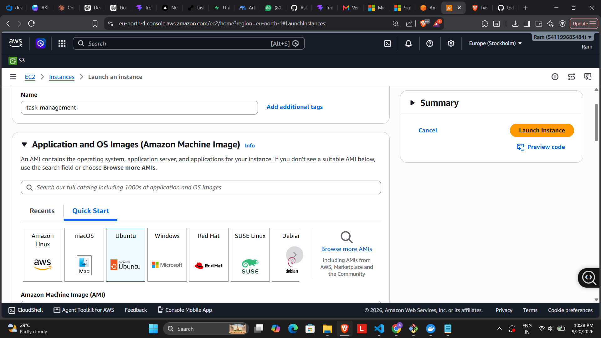

*Figure 1 — EC2 launch page with Ubuntu selected.*

### 3.3 Select the instance type

Use:

```text
t3.micro
```

This was sufficient for the Dockerized V3 demonstration deployment.

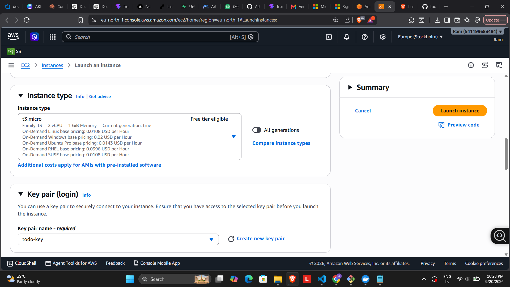

*Figure 2 — `t3.micro` instance selection.*

### 3.4 Configure the key pair

Select an existing key pair or create a new one. The deployment used a key pair named similar to:

```text
todo-key
```

Keep the private `.pem` file secure. **Never commit it to GitHub.**

---

# 4. Configure the EC2 Network and Security Group

The Security Group controls inbound traffic to the EC2 instance.

For the deployment demonstration, the following ports were configured:

| Protocol | Port | Source | Purpose |
|---|---:|---|---|
| TCP | `22` | Your IP recommended | SSH administration |
| TCP | `80` | `0.0.0.0/0` | Frontend HTTP |
| TCP | `5000` | `0.0.0.0/0` | Backend API |

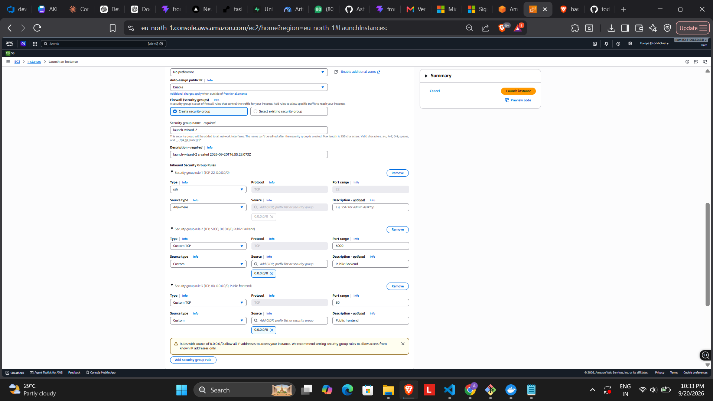

*Figure 3 — EC2 Security Group inbound rules.*

### DevOps/security note

For a production architecture, SSH should normally be restricted to trusted source IPs and the Flask port should not need to be publicly exposed if a reverse proxy/load balancer is placed in front of the backend.

For this project demonstration, port `5000` was opened so the backend container could be directly tested from outside the instance.

---

# 5. Configure Storage

The deployment used the default root volume:

```text
8 GiB
EBS gp3
```

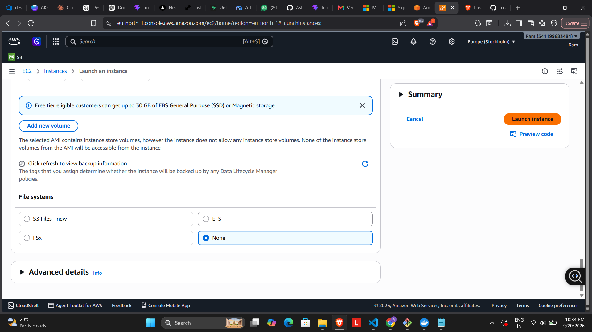

*Figure 4 — EC2 root storage configuration.*

The application data is stored in Supabase PostgreSQL, so the EC2 root disk is used for the operating system, Docker, images, and containers rather than as the primary application database.

---

# 6. Launch the Instance

Review the configuration and choose **Launch instance**.

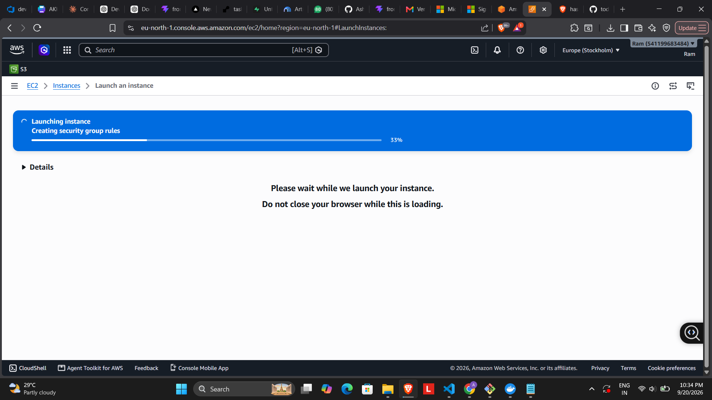

*Figure 5 — EC2 launch in progress.*

After AWS completes the launch, a successful launch confirmation is displayed.

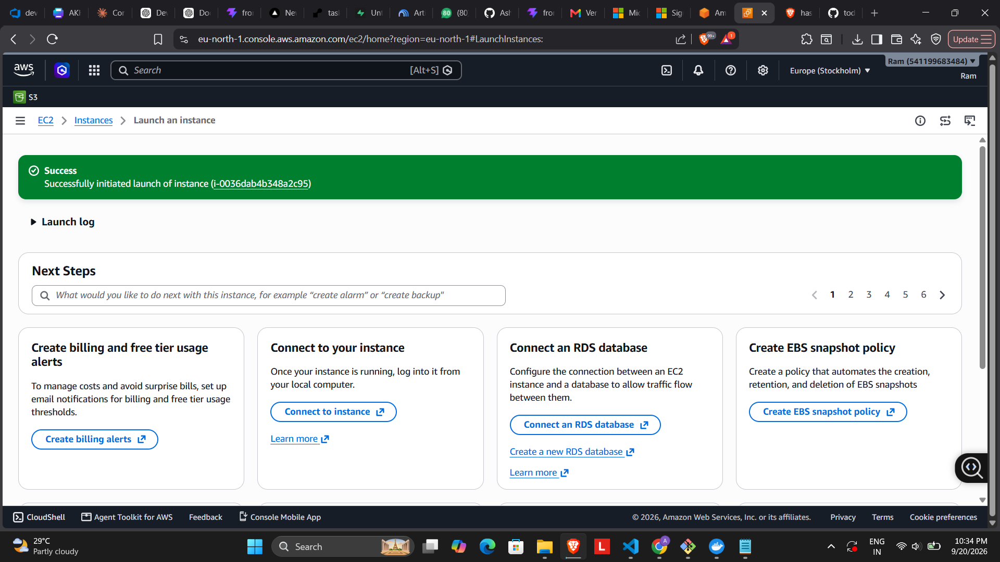

*Figure 6 — Successful EC2 instance launch.*

---

# 7. Verify the Running Instance

Return to **EC2 → Instances** and verify that the new instance is in the `Running` state.

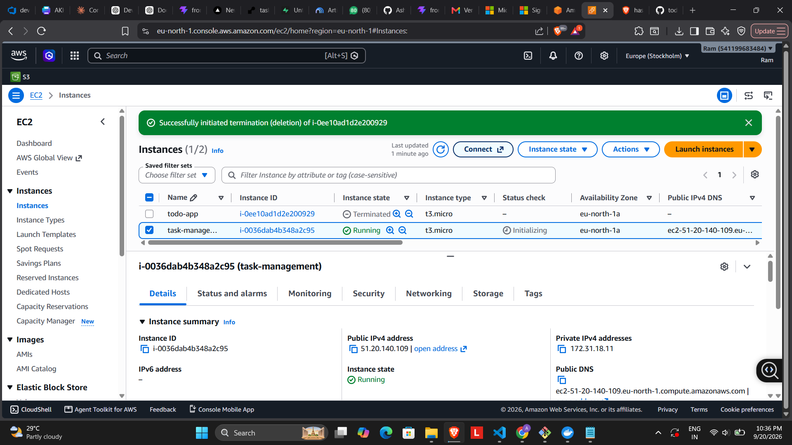

*Figure 7 — Running `task-management` EC2 instance.*

Record the public IPv4 address or public DNS name. Do not hard-code the IP into reusable documentation because an EC2 public IP can change when the instance is stopped and started unless an Elastic IP is used.

---

# 8. Connect to the EC2 Instance Using SSH

AWS provides the SSH connection information from the **Connect** page.

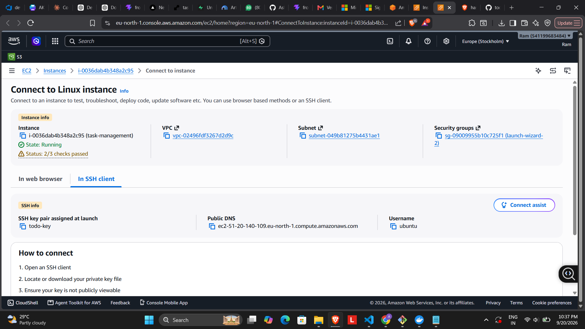

*Figure 8 — EC2 SSH connection information.*

From Git Bash on Windows, connect using:

```bash
ssh -i "todo-key.pem" ubuntu@<EC2_PUBLIC_IP>
```

The Ubuntu username for the Ubuntu AMI is:

```text
ubuntu
```

A successful SSH connection gives an Ubuntu shell prompt.

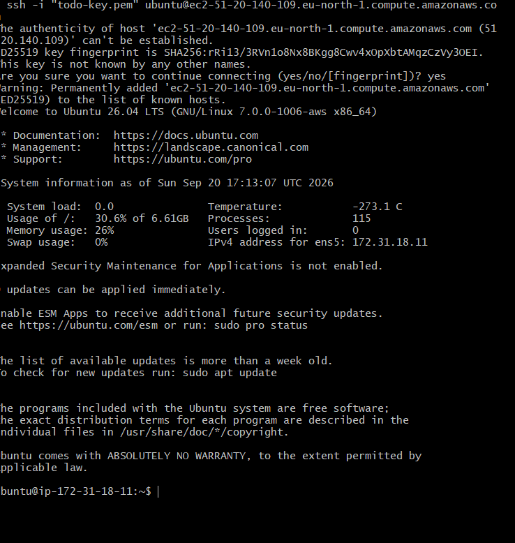

*Figure 9 — Successful SSH connection to the Ubuntu EC2 instance.*

---

# 9. Update the Ubuntu System

Update the package index and installed packages:

```bash
sudo apt update && sudo apt upgrade -y
```

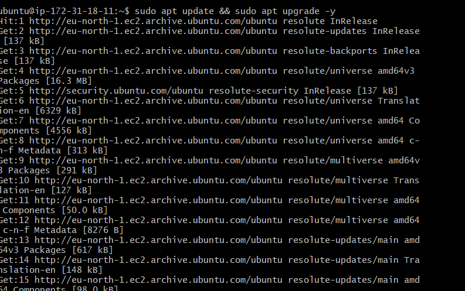

*Figure 10 — Updating Ubuntu packages.*

A kernel update may be reported during the upgrade. A reboot can be performed when required, but it is not necessary to interrupt the deployment if the application can continue safely.

---

# 10. Install Docker

Install Docker Engine from the Ubuntu package repository:

```bash
sudo apt install -y docker.io
```

Start Docker and configure it to start automatically:

```bash
sudo systemctl start docker
sudo systemctl enable docker
```

Allow the current user to run Docker without `sudo`:

```bash
sudo usermod -aG docker $USER
newgrp docker
```

Verify the installation:

```bash
docker --version
```

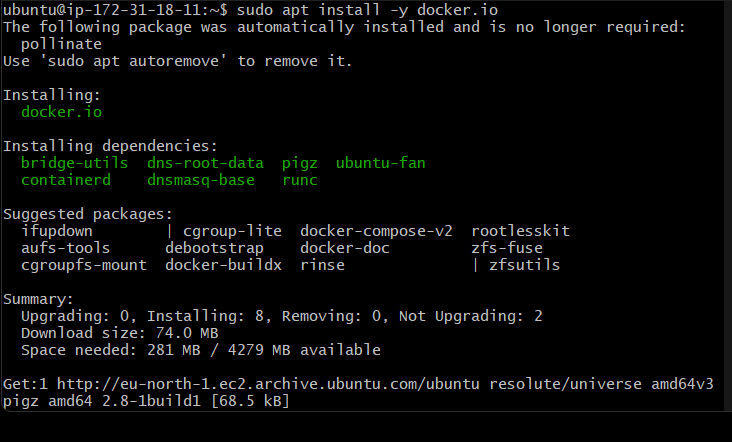

*Figure 11 — Docker installation on Ubuntu.*

---

# 11. Install Docker Compose

Install the Docker Compose v2 package:

```bash
sudo apt install -y docker-compose-v2
```

Verify:

```bash
docker compose version
```

The exact version may change as Ubuntu repositories are updated.

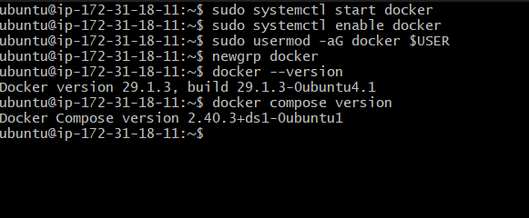

*Figure 12 — Docker and Docker Compose versions.*

> **Deployment method used for this EC2 test:** the containers were started with `docker run`. Docker Compose was installed so the same application can also be managed using the project's Compose configuration.

---

# 12. Configure Environment Variables

The backend requires:

```text
DATABASE_URL
JWT_SECRET_KEY
```

Create the environment file:

```bash
nano .env
```

Add your own values:

```env
DATABASE_URL=<your Supabase PostgreSQL connection string>
JWT_SECRET_KEY=<your JWT secret>
```

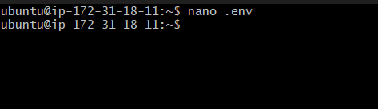

*Figure 13 — Creating the `.env` file.*

### Security rules

Do **not** commit the real `.env` file to GitHub.

The project `.gitignore` should contain:

```text
.env
*.db
instance/
```

Do not expose:

- Supabase database passwords
- JWT secrets
- SSH private keys
- `.pem` files

The screenshot above intentionally does not display secret values.

---

# 13. Pull the V3 Docker Images

The finalized V3 images are published to Docker Hub.

### Backend

```bash
docker pull akhilbm/todo-backend:3.0
```

### Frontend

```bash
docker pull akhilbm/todo-frontend:3.1
```

The deployment used these exact image tags:

```text
akhilbm/todo-backend:3.0
akhilbm/todo-frontend:3.1
```

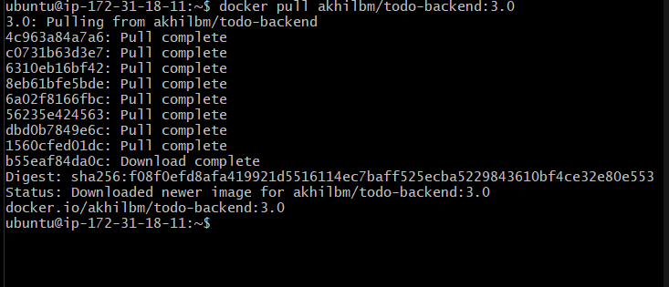

*Figure 14 — Pulling the V3 backend image.*

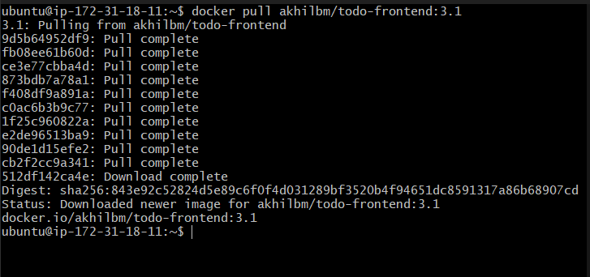

*Figure 15 — Pulling the V3 frontend image.*

Verify the downloaded images:

```bash
docker images
```

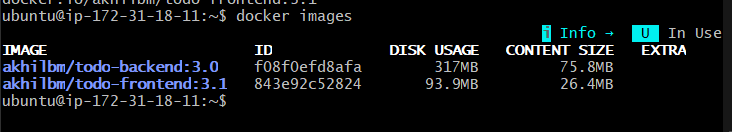

*Figure 16 — V3 Docker images available on the EC2 instance.*

---

# 14. Start the Backend Container

Run the backend container using the environment file:

```bash
docker run -d \
  -p 5000:5000 \
  --env-file .env \
  --name backend \
  akhilbm/todo-backend:3.0
```

This maps:

```text
EC2 port 5000 → container port 5000
```

The backend runs Gunicorn inside the container.

---

# 15. Start the Frontend Container

Run the frontend container:

```bash
docker run -d \
  -p 80:80 \
  --name frontend \
  akhilbm/todo-frontend:3.1
```

This maps:

```text
EC2 port 80 → Nginx container port 80
```

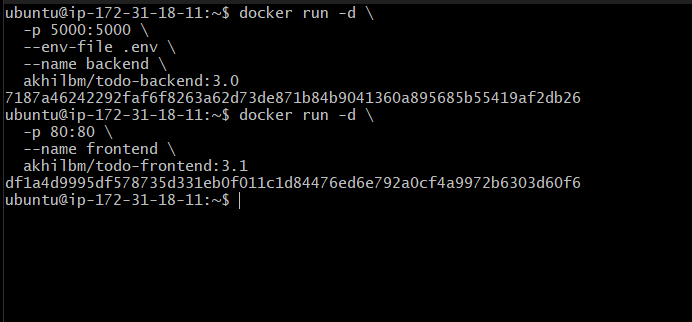

*Figure 17 — Starting the backend and frontend containers.*

---

# 16. Verify Running Containers

Check the container status:

```bash
docker ps
```

Expected port mappings are similar to:

```text
backend    0.0.0.0:5000->5000/tcp
frontend   0.0.0.0:80->80/tcp
```

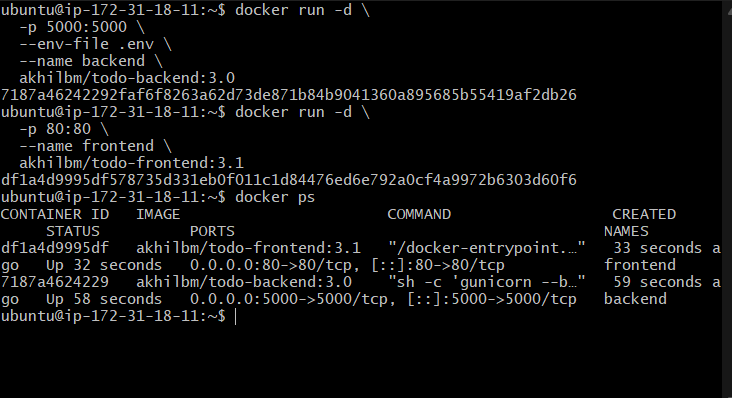

*Figure 18 — Both application containers running.*

For troubleshooting, use:

```bash
docker ps -a
docker logs backend
docker logs frontend
```

---

# 17. Backend Health Check

The backend exposes a health endpoint:

```text
GET /api/health
```

Run from the EC2 instance:

```bash
curl http://localhost:5000/api/health
```

Expected response:

```json
{"status":"healthy"}
```

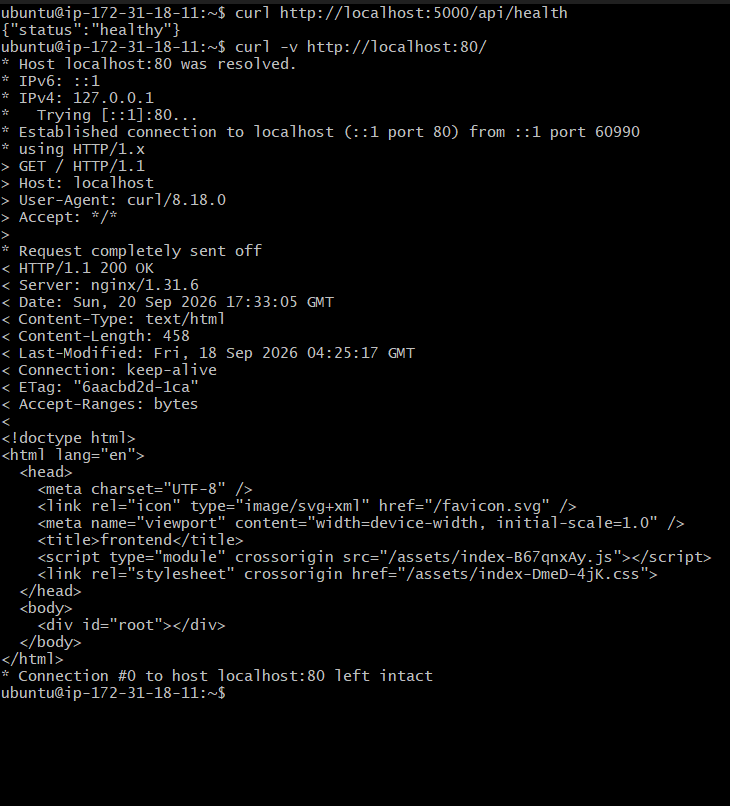

*Figure 19 — Backend health endpoint returning a healthy response and frontend HTTP verification.*

This confirms that the Flask/Gunicorn container is responding on port `5000`.

---

# 18. Access the Application in a Browser

Open:

```text
http://<EC2_PUBLIC_IP>/
```

The browser should display the My Tasks login page.

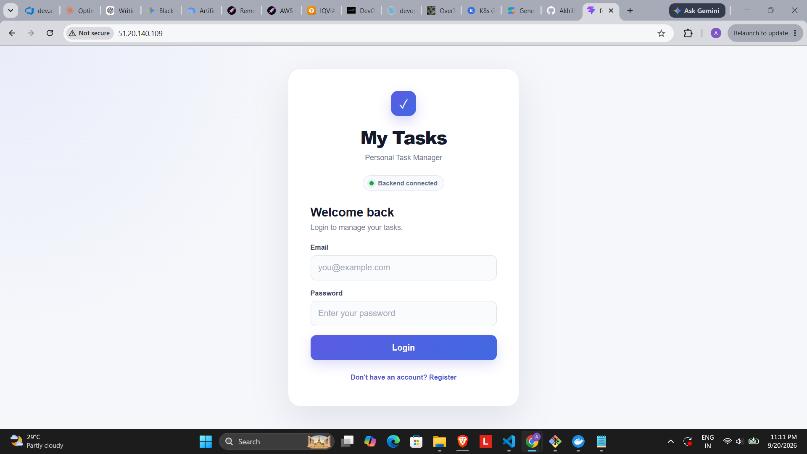

*Figure 20 — My Tasks login page served from the EC2 deployment.*

After login, the dashboard can be used to validate the application.

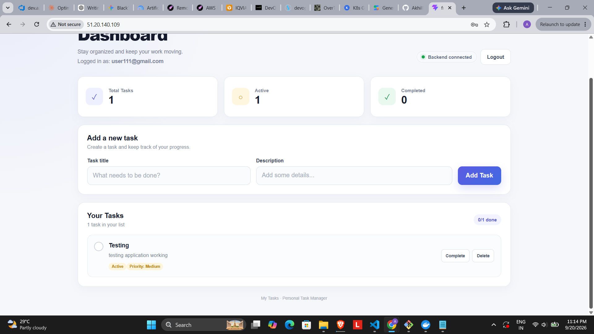

*Figure 21 — Dashboard with a task created during deployment testing.*

The task can then be completed to verify the application flow.

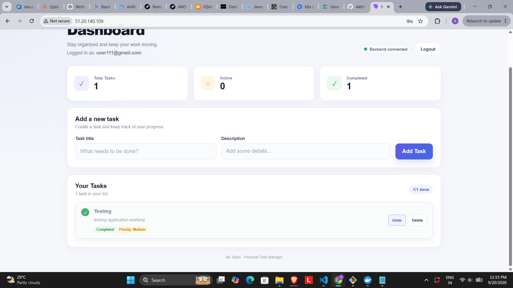

*Figure 22 — Task completion verification.*

---

# 19. Application Verification Checklist

Use this checklist after deployment:

- [x] EC2 instance launched
- [x] Ubuntu Server configured
- [x] `t3.micro` instance selected
- [x] Security Group configured
- [x] SSH access verified
- [x] Ubuntu packages updated
- [x] Docker installed
- [x] Docker Compose installed
- [x] Environment variables configured
- [x] Backend V3 image pulled
- [x] Frontend V3 image pulled
- [x] Backend container started
- [x] Frontend container started
- [x] `docker ps` verified both containers
- [x] Backend `/api/health` returned healthy
- [x] Frontend opened through the EC2 public address
- [x] Login page verified
- [x] Dashboard verified
- [x] Task creation verified
- [x] Task completion verified
- [x] Supabase PostgreSQL used as the external database

---

# 20. Troubleshooting

## Backend container stopped

```bash
docker ps -a
docker logs backend
```

Check that `DATABASE_URL` and `JWT_SECRET_KEY` are present and valid.

## Frontend is not reachable

Check:

```bash
docker ps
docker logs frontend
curl http://localhost:80
```

Then verify that the Security Group allows TCP port `80`.

## Backend is reachable locally but not externally

Test locally:

```bash
curl http://localhost:5000/api/health
```

If that succeeds, verify the Security Group allows TCP `5000` for this demonstration deployment.

## SSH fails

Verify:

- EC2 instance is running
- Public IP/DNS is correct
- Username is `ubuntu`
- Correct `.pem` key is being used
- Port `22` is allowed by the Security Group

## Check container logs

```bash
docker logs backend
docker logs frontend
```

---

# 21. Container Management Commands

Stop the application:

```bash
docker stop backend frontend
```

Start it again:

```bash
docker start backend frontend
```

Remove the containers:

```bash
docker rm backend frontend
```

List all containers:

```bash
docker ps -a
```

List Docker images:

```bash
docker images
```

---

# 22. Security and Production Improvements

The configuration above is suitable for a project/demo deployment. A production-oriented version could improve the architecture by:

1. Restricting SSH access to a trusted IP range.
2. Avoiding public exposure of backend port `5000`.
3. Putting Nginx or an AWS load balancer in front of the backend.
4. Serving the application through HTTPS using a domain name and TLS certificate.
5. Moving secrets to a managed secrets system rather than a local `.env` file.
6. Using an Elastic IP or DNS instead of relying on an ephemeral public IP.
7. Using a managed deployment/orchestration platform for scaling and high availability.
8. Adding monitoring, logging, backups, and alerting.

These are production improvements; they are not required for the demonstrated V3 EC2 deployment.

---

# 23. AWS Deployment Summary

```text
1. Launch Ubuntu EC2
        |
2. Configure Security Group
        |
3. Connect using SSH
        |
4. Update Ubuntu
        |
5. Install Docker
        |
6. Install Docker Compose
        |
7. Configure .env
        |
8. Pull V3 images from Docker Hub
        |
9. Run backend container :5000
        |
10. Run frontend container :80
        |
11. Verify docker ps
        |
12. Test /api/health
        |
13. Open application in browser
        |
14. Test login and task operations
```

---

# 24. Docker Images Used

| Component | Docker image |
|---|---|
| Backend | `akhilbm/todo-backend:3.0` |
| Frontend | `akhilbm/todo-frontend:3.1` |

The database is not containerized in this deployment. It is hosted on **Supabase PostgreSQL**.

---

# 25. Final Deployment State

At the end of the deployment, the EC2 host contains:

```text
AWS EC2 (Ubuntu)
│
├── Docker
│   │
│   ├── backend container
│   │   └── Flask + Gunicorn :5000
│   │
│   └── frontend container
│       └── React build + Nginx :80
│
└── .env
    ├── DATABASE_URL
    └── JWT_SECRET_KEY
```

The backend connects to Supabase PostgreSQL and the frontend is served publicly through Nginx on the EC2 instance.

---

## Screenshot Notes

The screenshots included in this report were selected from the deployment captures. Repeated screenshots of the same step were removed so the guide remains readable while retaining the important evidence for the full deployment workflow.

**Never commit:**

```text
.env
*.pem
private keys
real database passwords
real JWT secrets
```
